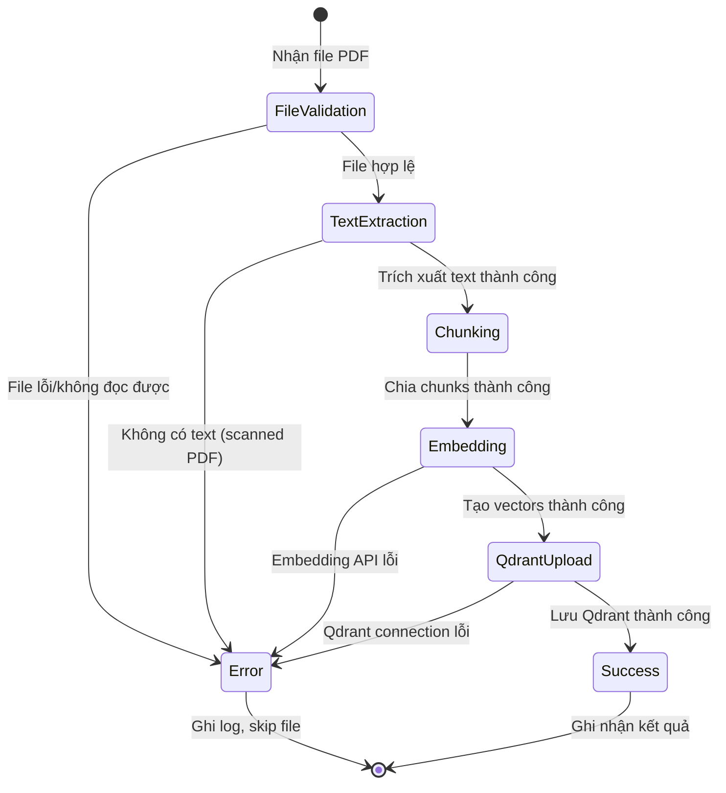

# Data Model: UC-003 — Nạp Tài liệu Y khoa vào Hệ thống RAG

**Date**: 2026-06-15

## Entities

### 1. SourceDocument

Đại diện cho file PDF nguồn được nạp vào hệ thống.

| Field         | Type     | Required | Description                                   |
|---------------|----------|----------|-----------------------------------------------|
| `file_path`   | `str`    | ✅       | Đường dẫn tuyệt đối đến file PDF              |
| `file_name`   | `str`    | ✅       | Tên file (basename), ví dụ: `BMC_Diabetes_Handout_2024_vie.pdf` |
| `content`    | `str`    | ✅       | Nội dung của file pdf (do dev nhập khi nạp tài liệu)                         |
| `total_pages` | `int`    | ✅       | Tổng số trang của PDF                          |
| `file_size`   | `int`    | ✅       | Kích thước file (bytes)                        |

**Validation Rules**:
- `file_path` phải tồn tại trên filesystem
- File phải có extension `.pdf`
- File phải đọc được (không bị corrupt hoặc password-protected)

---

### 2. DocumentChunk

Một phần nhỏ của tài liệu sau khi chia nhỏ, đơn vị cơ bản cho retrieval.

| Field          | Type     | Required | Description                                       |
|----------------|----------|----------|---------------------------------------------------|
| `document_id`           | `str`    | ✅       | UUID duy nhất của tài liệu                            |
| `content`      | `str`    | ✅       | Nội dung text của chunk                            |
| `source`       | `str`    | ✅       | Tên file PDF nguồn                                 |
| `page`         | `int`    | ✅       | Số trang chứa chunk (trang đầu tiên nếu span)     |
| `chunk_index`  | `int`    | ✅       | Thứ tự chunk trong tài liệu      |

**Validation Rules**:
- `content` không được rỗng (sau khi strip whitespace)
- `page` >= 1
- `chunk_index` >= 0

---

### 3. EmbeddedChunk

Chunk đã được tạo embedding vector, sẵn sàng lưu vào Qdrant.

| Field       | Type           | Required | Description                              |
|-------------|----------------|----------|------------------------------------------|
| `id`           | `str`    | ✅       | UUID duy nhất cho chunk(tương ứng với document_chunk)
                |
| `vector`    | `list[float]`  | ✅       | Embedding vector     |
| `payload`     | `dict`| ✅       | bao gồm content, source, page, chunk_index, document_id

**Validation Rules**:
- Các giá trị trong vector phải là float hợp lệ (không NaN, không Inf)

---

### 4. IngestionResult

Kết quả của quá trình nạp dữ liệu.

| Field              | Type     | Required | Description                              |
|--------------------|----------|----------|------------------------------------------|
| `total_files`      | `int`    | ✅       | Tổng số file PDF được xử lý              |
| `success_files`    | `int`    | ✅       | Số file xử lý thành công                 |
| `failed_files`     | `int`    | ✅       | Số file bị lỗi                           |
| `total_chunks`     | `int`    | ✅       | Tổng số chunks đã nạp vào Qdrant         |
| `elapsed_seconds`  | `float`  | ✅       | Thời gian xử lý (giây)                   |
| `errors`           | `list[IngestionError]` | ✅ | Danh sách lỗi chi tiết             |

---

### 5. IngestionError

Chi tiết lỗi khi xử lý một file.

| Field       | Type     | Required | Description                              |
|-------------|----------|----------|------------------------------------------|
| `file_name` | `str`    | ✅       | Tên file bị lỗi                          |
| `error_type`| `str`    | ✅       | Loại lỗi (FileNotFound, PDFReadError, EmbeddingError, QdrantError) |
| `message`   | `str`    | ✅       | Mô tả lỗi chi tiết                       |

## Qdrant Collection Schema

**Collection**: `medical_documents`

```json
{
  "id": "str",
  "vector": "list",
  "payload_schema": {
    "content": "text",
    "source": "keyword",
    "page": "integer",
    "chunk_index": "integer",
    "document_id": "str"
  }
}
```

## State Transitions


