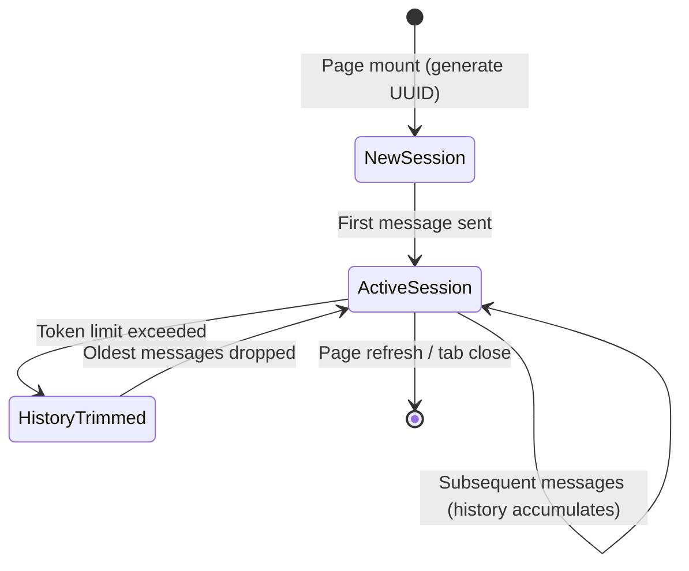

# Data Model: UC-009 Chat History

## Entities

### 1. ChatRequest (API Schema — Modified)

**File**: `src/api/schemas.py`

| Field       | Type           | Required | Description                                                |
|-------------|----------------|----------|------------------------------------------------------------|
| question    | str            | Yes      | The user's question (existing, unchanged)                  |
| session_id  | str \| None    | No       | Frontend-generated UUID for session scoping. Defaults to a random UUID if omitted (backward compat). |

### 2. AgentState (LangGraph State — Modified)

**File**: `src/agents/state.py`

| Field         | Type                                  | Description                                              |
|---------------|---------------------------------------|----------------------------------------------------------|
| messages      | Annotated[list[BaseMessage], add_messages] | **Existing** — auto-accumulated by MessagesState. Now actively used for chat history. |
| user_input    | str                                   | Existing — original question                             |
| chat_history  | list[BaseMessage]                     | **New** — trimmed history extracted from `messages` for node consumption |
| *(all other existing fields unchanged)* | | |

> **Note**: `chat_history` is a convenience field populated by a pre-processing step. It contains the trimmed subset of `messages` ready for LLM prompts. Nodes read `chat_history` instead of raw `messages` to ensure token limits are respected.

### 3. Session Store (In-Memory — Via MemorySaver)

**Mechanism**: LangGraph `MemorySaver` checkpointer

| Concept     | Implementation                           | Description                                     |
|-------------|------------------------------------------|-------------------------------------------------|
| thread_id   | `session_id` from ChatRequest            | Keys the conversation thread                    |
| Storage     | `MemorySaver()` (in-memory dict)         | Stores serialized graph state per thread         |
| Lifecycle   | Lives in Python process memory           | Cleared on server restart                        |

No new database tables or external storage required.

---

## State Transitions



---

## Key Data Flows

### Message Flow Per Request

```
Frontend                          Backend (FastAPI)                    LangGraph Pipeline
────────                          ──────────────────                   ────────────────────
1. POST /api/chat                
   { question, session_id }  ──→  2. Extract session_id
                                  3. Build initial state:
                                     user_input = question           
                                  4. Invoke graph with              ──→  5. MemorySaver loads
                                     config.thread_id = session_id        prior messages into
                                                                          state.messages
                                                                     6. trim_messages → chat_history
                                                                     7. Nodes use chat_history
                                                                        in LLM prompts
                                                                     8. Response added to messages
                                  9. MemorySaver persists state  ←──  
                                 10. Return answer text
   ←── answer text ─────────────
```

---

## Configuration

| Parameter              | Default | Source      | Description                                           |
|------------------------|---------|-------------|-------------------------------------------------------|
| CHAT_HISTORY_MAX_TOKENS| 4000    | `.env`      | Max tokens for trimmed history sent to LLM nodes      |

---

## Validation Rules

1. `session_id`: Must be a valid UUID string if provided; auto-generated if omitted
2. `chat_history` trimming: Always preserves the most recent user message; trims oldest turns first
3. Token limit: Configurable via `CHAT_HISTORY_MAX_TOKENS`; defaults to 4000 tokens
