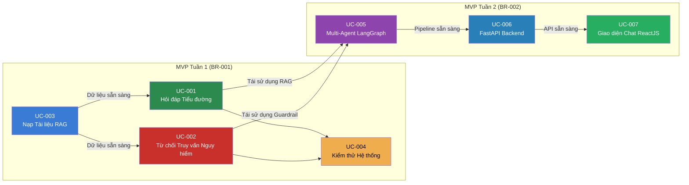

# DiaCareFlow — Use Cases Index

**Source**: [BR-001.md](file:///h:/project/DiaCareFlow/specs/bussiness-requirements/BR-001.md), [BR-002.md](file:///h:/project/DiaCareFlow/specs/bussiness-requirements/BR-002.md)

**Created**: 2026-06-15

**Updated**: 2026-06-23

**Status**: Active

---

## Tổng quan

Tài liệu này liệt kê tất cả Use Cases của dự án DiaCareFlow, phân chia theo từng Sprint (tuần).

## Sơ đồ Luồng Use Cases

## Danh sách Use Cases

### MVP Tuần 1 (BR-001) — ✅ Hoàn thành

| ID | Tên | Actor | Priority | Phụ thuộc | Spec |
|----|-----|-------|----------|-----------|------|
| UC-001 | Hỏi đáp Y khoa về Tiểu đường | Người dùng cuối | P1 | UC-003 | [UC-001](file:///h:/project/DiaCareFlow/specs/use-cases/UC-001-hoi-dap-tieu-duong.md) |
| UC-002 | Từ chối Truy vấn Nguy hiểm | Người dùng cuối | P1 | UC-003 | [UC-002](file:///h:/project/DiaCareFlow/specs/use-cases/UC-002-tu-choi-truy-van-nguy-hiem.md) |
| UC-003 | Nạp Tài liệu Y khoa vào RAG | Admin/Developer | P1 (tiên quyết) | — | [UC-003](file:///h:/project/DiaCareFlow/specs/use-cases/UC-003-nap-tai-lieu-rag.md) |
| UC-004 | Kiểm thử Chất lượng Hệ thống | Admin/Developer | P1 | UC-001, UC-002 | [UC-004](file:///h:/project/DiaCareFlow/specs/use-cases/UC-004-kiem-thu-he-thong.md) |

### MVP Tuần 2 (BR-002) — 🔄 In Progress

| ID | Tên | Actor | Priority | Phụ thuộc | Spec |
|----|-----|-------|----------|-----------|------|
| UC-005 | Multi-Agent Pipeline LangGraph | Developer | P1 (core) | UC-001, UC-002 | [UC-005](file:///h:/project/DiaCareFlow/specs/UC-005-multi-agent-langgraph/spec.md) |
| UC-006 | FastAPI Backend REST API | Developer | P1 | UC-005 | [UC-006](file:///h:/project/DiaCareFlow/specs/UC-006-fastapi-backend/spec.md) |
| UC-007 | Giao diện Chat ReactJS | Người dùng cuối | P2 | UC-006 | [UC-007](file:///h:/project/DiaCareFlow/specs/UC-007-giao-dien-chat-reactjs/spec.md) |

## Thứ tự Thực hiện Tuần 2 (Tracer Bullet)

1. **Phase 1 — Skeleton E2E**: Dựng FastAPI mỏng + UI mỏng, gọi pipeline cũ (Tuần 1) → Full pipeline chạy được ngay.
2. **Phase 2 — LangGraph Core**: Thay pipeline cũ bằng LangGraph (2 nodes: Guardrail → QA RAG).
3. **Phase 3 — Multi-Agent Expansion**: Mở rộng LangGraph thành 4 agents (Supervisor → Harm Assessment → RAG → Response).
4. **Phase 4 — UI Polish**: Branding y tế cho giao diện ReactJS.

## Mapping với BR-002

| BR-002 In Scope | Use Case(s) |
|-----------------|-------------|
| Các node LangGraph core if/else → mở rộng lên các agent | UC-005 |
| Chạy được luồng logic các node LangGraph sử dụng trên UI | UC-006, UC-007 |
| Static UI: giao diện tĩnh (ReactJS) branding y tế | UC-007 |

## Out of Scope (MVP Tuần 2)

Các use-cases dưới đây sẽ được bổ sung ở các tuần sau:

- UC-0xx: Các Agent Nâng cao (Suggestion Agent, Factor Analysis Agent)
- UC-0xx: Web Search Integration (SearXNG)
- UC-0xx: Document Pipeline Động (user upload từ UI)
- UC-0xx: Hệ thống User & Lịch sử Chat (JWT, Redis)
- UC-0xx: API End-to-End & Streaming (SSE/WebSocket)
- UC-0xx: Deployment (Docker, Cloud)
