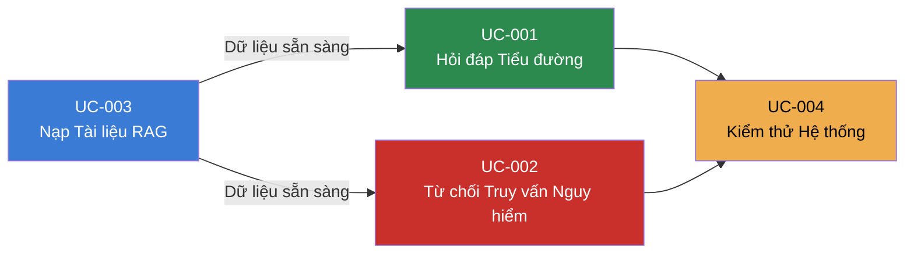

# DiaCareFlow — Use Cases Index (MVP Tuần 1)

**Source**: [BR-001.md](file:///h:/project/DiaCareFlow/specs/bussiness-requirements/BR-001.md)

**Created**: 2026-06-15

**Status**: Draft

---

## Tổng quan

Tài liệu này liệt kê các Use Cases được phân tách từ BR-001 (MVP Tuần 1). Mỗi use-case có file spec riêng theo format spec-template đầy đủ.

## Sơ đồ Luồng Use Cases

## Danh sách Use Cases

| ID | Tên | Actor | Priority | Phụ thuộc | Spec |
|----|-----|-------|----------|-----------|------|
| UC-001 | Hỏi đáp Y khoa về Tiểu đường | Người dùng cuối | P1 | UC-003 | [UC-001-hoi-dap-tieu-duong.md](file:///h:/project/DiaCareFlow/specs/use-cases/UC-001-hoi-dap-tieu-duong.md) |
| UC-002 | Từ chối Truy vấn Nguy hiểm | Người dùng cuối | P1 | UC-003 | [UC-002-tu-choi-truy-van-nguy-hiem.md](file:///h:/project/DiaCareFlow/specs/use-cases/UC-002-tu-choi-truy-van-nguy-hiem.md) |
| UC-003 | Nạp Tài liệu Y khoa vào RAG | Admin/Developer | P1 (tiên quyết) | — | [UC-003-nap-tai-lieu-rag.md](file:///h:/project/DiaCareFlow/specs/use-cases/UC-003-nap-tai-lieu-rag.md) |
| UC-004 | Kiểm thử Chất lượng Hệ thống | Admin/Developer | P1 | UC-001, UC-002 | [UC-004-kiem-thu-he-thong.md](file:///h:/project/DiaCareFlow/specs/use-cases/UC-004-kiem-thu-he-thong.md) |

## Thứ tự Thực hiện Đề xuất

1. **UC-003** (Nạp tài liệu) → Tiên quyết, phải hoàn thành trước
2. **UC-002** (Guardrails) → Xây dựng lớp bảo vệ an toàn
3. **UC-001** (Hỏi đáp RAG) → Luồng chính, cần dữ liệu + guardrail sẵn sàng
4. **UC-004** (Testing) → Đánh giá toàn bộ sau khi hoàn thành 3 UC trên

## Mapping với BR-001

| BR-001 Section | Use Case(s) |
|----------------|-------------|
| RAG đơn giản (đọc, chunking, embedding, retrieval) | UC-003, UC-001 |
| Guardrail Node (phân loại an toàn/nguy hiểm) | UC-002 |
| QA RAG Node (trả lời câu hỏi an toàn) | UC-001 |
| Kiểm thử (Testing & Evaluation) | UC-004 |

## Out of Scope (MVP Tuần 1)

Các use-cases dưới đây sẽ được bổ sung ở các tuần sau:

- UC-0xx: Frontend & UI (Chat Interface)
- UC-0xx: Multi-Agent (Supervisor, Suggestion, Factor Analysis)
- UC-0xx: Web Search Integration
- UC-0xx: Document Pipeline Động (người dùng tự upload)
- UC-0xx: Hệ thống User & Lịch sử Chat
- UC-0xx: API End-to-End & Streaming
- UC-0xx: Deployment (Cloud)
